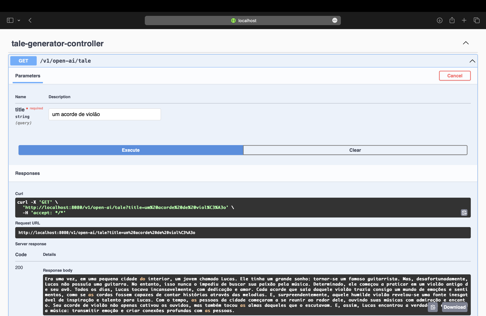

# group components

- Andrew Costa Silva - 1137978
- Arthur Guterres Boeck - 1470051
- Danielson Augusto - 1481701
- Diego Ribeiro Alvarenga Silva - 1200783
- Guilherme Bruno Rodrigues Silva - 1177412
- Leandro Molinari - 1453411

# open-ai-tale-generator

This is a small application that uses GPT-3.5 Turbo to generate tales of a given user input. 

## Requirements

1. To use this application, you must have an [OpenAI account and have credits available to use](https://platform.openai.com/).
2. You must have Java Development Kit on version 17
    - You can check your version by running `java -version` in your terminal

## Usage

1. Clone this repository and open it in your IDE of choice
2. Open the configuration file located at [bootstrap.yml](./src/main/resources/bootstrap.yml) and replace the `"<YOUR-API-KEY>"` with your OpenAI token:
    
```yaml
service:
  open-ai:
    key: <YOUR-API-KEY>
```

3. Build the project using the command: `./gradlew build -x test`
4. Start the SpringBoot Aplication using the command: `./gradlew bootRun`
5. Open the browser and pass the desired title to generate `localhost:8080/v1/open-ai/tales?title=your_title_here` or use a tool like [Postman](https://www.postman.com/) to make a GET request to the same URL. Otherwise, eu can access throgh the Swagger UI at `localhost:8080/swagger-ui.html`

## Screenshots

A tale generated with the title "Um acorde de violão"


