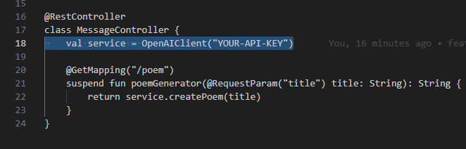
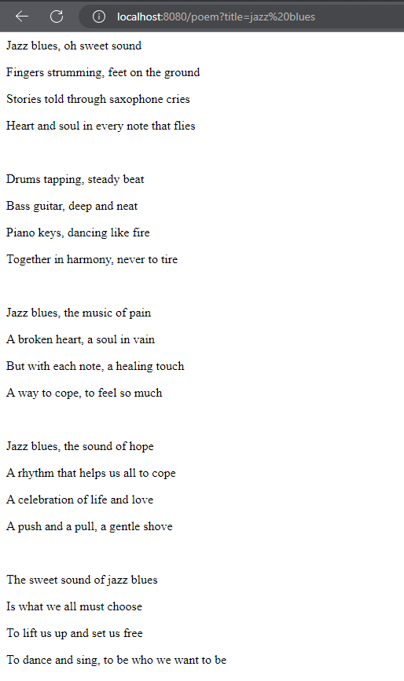

# Poem Generator

This is a small application that uses GPT-3.5 Turbo to generate poems of a given user input. 

## Requirements

1. To use this application, you must have an [OpenAI account and have credits available to use](https://platform.openai.com/).
2. You must have Java Development Kit on version 17
    - You can check your version by running `java -version` in your terminal

## Usage

1. Clone this repository and open it in your IDE of choice
2. Open the MessageController located at [PoemGeneratorApplication.kt](src\main\kotlin\com\andrew\poemgenerator\PoemGeneratorApplication.kt) and replace the `"YOUR-API-KEY"` with your OpenAI token:
    - 
3. Build the project
4. Open the browser and pass the desired title to generate `localhost:8080/poem?title=your_title_here` or use a tool like [Postman](https://www.postman.com/) to make a GET request to the same URL

## Screenshots

A poem generated with the title "Jazz Blues"

